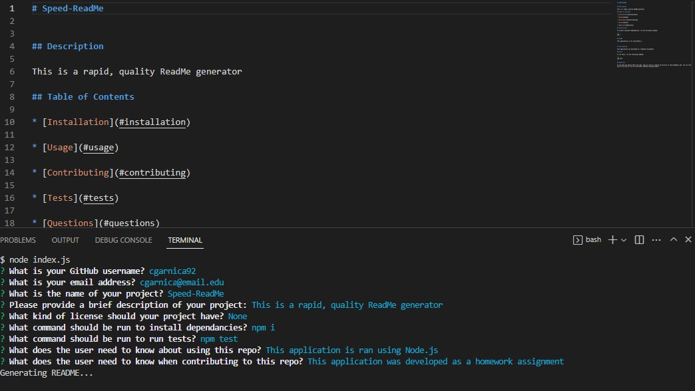

# Speed-ReadMe

## Description

This is a rapid, quality ReadMe generator. By asking a user a quick few questions, this application constructs the given information into structured markup. The app was even made to make this very ReadMe!

## Table of Contents

* [Installation](#installation)

* [Usage](#usage)

* [Contributing](#contributing)

* [Tests](#tests)

* [Questions](#questions)

## Installation

To install necessary dependencies, run the following command:

'''
npm i
'''

## Usage

This application is ran using Node.js

## Contributing

This application was developed as a homework assignment

## Tests

To run tests, run the following command:

'''
npm test
'''

## Questions

If you have any quests about the repo, open an issue or contact me directly at cgarnica@email.edu. You can find more of my work at [cgarnica92](https://github.com/cgarnica92/).

